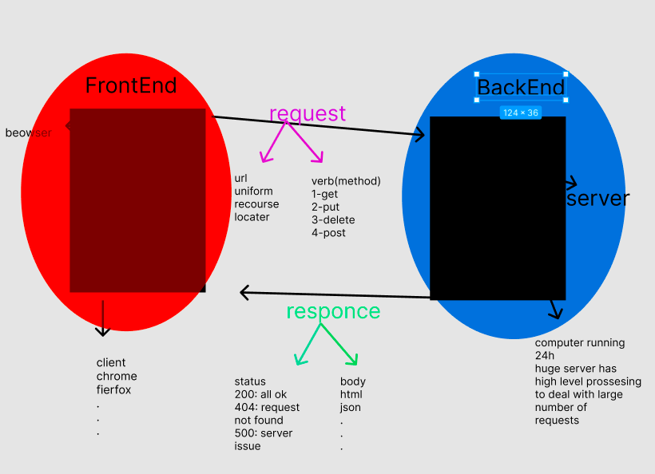

# Project Name - Movies Library

**Author Name**: Raed okour

## WRRC

## Overview
this website will return the latest movies and will give you access to the trending movies in the world

## Getting Started

- setup the server 
  - require express and cors
  - set the endpoints required.
  - implement the functions handlers 
- start the server. 

## Tree
Movies-Library
   ├── Movie Data
   |     └── data.json
   ├── .eslintrc.json
   ├── .env
   ├── .gitignore
   ├── package-lock.json
   ├── package.json
   ├── README.md
   └── index.js

## Project Features
you can add a movie to the database 
you can get all movies from the database
